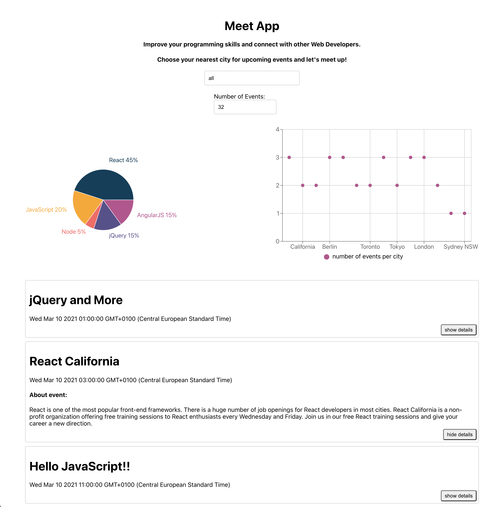

# Meet App

## About

Meet application is a progressive web application (by create-react-app) that uses Google Calender API and a serverless backend with AWS Lambda. It fetches events from the API so users can view a list of upcoming events. 

See the **hosted project** [here](https://joolanda.github.io/meet/).  

For this project I was using a test driven development(TDD - writing tests first, code later) approach with Enzyme and Jest. Translated userstories into scenarios for Unit testing, Acceptance testing, and End-to-End testing.

## Features & Requirements

#### key features 
- Allows users to filter events by city
- Users can show and hide event details
- Users can specify the number of events they see displayed
- Allows users to use the app when offline
- Add an app shortcut to the homescreen
- View a chart showing the number of upcoming events by city

#### Userstories and Scenario's 
For more information about userstories, see portfolio (currently working on this to showcase)

## Technologies
- React application created with React framework
- Google Calendar API and OAuth2 authentication flow
- AWS Lambda serverless functions
- Recharts for data visualisation

#### Dependencies 
- "@testing-library/jest-dom": "^4.2.4",
- "@testing-library/react": "^9.3.2",
- "@testing-library/user-event": "^7.1.2",
- "atatus-spa": "4.2.1",
- "axios": "0.20.0",
- "moment": "2.29.1",
- "node": "15.4.0",
- "nprogress": "0.2.0",
- "react": "^16.13.1",
- "react-dom": "^16.13.1",
- "react-scripts": "3.4.4",
- "recharts": "1.8.5",
- "typescript": "4.1.3"

